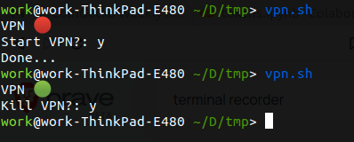

# Automatically connector to openvpn3

Automatically connects to openvpn3, checks if it's connected, and kill process if needd

Setup

1. edit `vpn.sh` to your path to `auto_vpn_login.py` location
2. edit `auto_vpn_login.py` add your parth to .ovpn file and add `username` and `password`
3. add directory to path location

